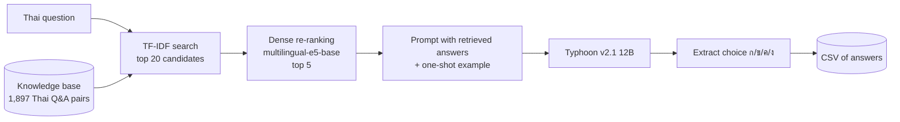

# Medist: Thai Healthcare Assistant (CMKL Hackathon)

A hackathon prototype exploring how a Thai-language LLM can help people understand Thailand's healthcare system. It has two parts:

- a **retrieval-augmented generation (RAG) pipeline** that answers Thai multiple-choice questions about Universal Coverage Scheme (30 Baht) benefits, using the [Typhoon](https://opentyphoon.ai) LLM, and
- a **React web app** with a chatbot and a set of personal health tools.

> **Status:** hackathon prototype. Some screens in the web app are UI mock-ups (see [Current limitations](#current-limitations)).

## Problem

Information about Thai public healthcare rights, such as what the 30 Baht scheme covers and where you can be treated, is spread across many official documents and written in formal Thai. General-purpose LLMs often answer these questions incorrectly because they lack the source material.

## Approach

### Hybrid RAG for Thai medical QA (`backend/rag_hybrid_parameter.py`)



1. The knowledge base [`backend/Ai_qa_combine.txt`](backend/Ai_qa_combine.txt) holds 1,897 Thai question–answer pairs about healthcare benefits.
2. **Sparse retrieval:** TF-IDF selects the 20 closest stored questions.
3. **Dense re-ranking:** `intfloat/multilingual-e5-base` sentence embeddings re-rank those 20 by cosine similarity and keep the top 5.
4. The retrieved answers are given to `typhoon-v2.1-12b-instruct` as context, with a Thai system prompt and a one-shot example.
5. A regex extractor normalizes the reply to a Thai choice letter (ก, ข, ค, ง), also mapping English A–D.

[`backend/sixty60.py`](backend/sixty60.py) is the **baseline**: the same questions answered by Typhoon with no retrieved context, for comparison.

### Web app (`frontend/`)

A single-page React app with two groups of features:

| Feature | Status |
| --- | --- |
| Chatbot (talks to the Flask `/chat` API) | Working, needs the backend running |
| BMI calculator | Working (client-side) |
| Medication reminder with browser notifications and sound | Working (client-side) |
| Sleep, screen-time, cycle and pregnancy trackers | Working (client-side) |
| 30 Baht benefit info, travel info, appointment assistant, lab & imaging | Informational / UI screens |
| Medical note summarizer, clinical support | Placeholder only |

## Tech stack

- **LLM:** Typhoon v2.1 12B Instruct via the OpenAI-compatible API
- **Retrieval:** scikit-learn (TF-IDF), sentence-transformers (`multilingual-e5-base`), PyTorch
- **Backend:** Python, Flask, Flask-CORS, pandas
- **Frontend:** React 19, Create React App, Emotion

## Project structure

```
CMKL_Hackathon/
├── backend/
│   ├── main.py                    # Flask API: POST /chat
│   ├── rag_hybrid_parameter.py    # Hybrid RAG batch evaluation
│   ├── sixty60.py                 # No-retrieval baseline
│   ├── test.py                    # Quick request to the /chat API
│   ├── Ai_qa_combine.txt          # Thai healthcare Q&A knowledge base
│   ├── requirements.txt
│   └── .env.example
└── frontend/
    └── src/
        ├── App.js                 # Layout, service tabs, self-care tools
        └── components/            # One component per tool
```

## Setup

You need Python 3.10+, Node.js 18+, and a Typhoon API key from [opentyphoon.ai](https://opentyphoon.ai).

### Backend

```bash
cd backend
python -m venv .venv
.venv\Scripts\activate          # macOS/Linux: source .venv/bin/activate
pip install -r requirements.txt
```

Set your API key (copy `.env.example` for reference):

```bash
# Windows PowerShell
$env:TYPHOON_API_KEY="your-key"
# macOS/Linux
export TYPHOON_API_KEY="your-key"
```

Run the chat API:

```bash
python main.py                  # http://localhost:5000
python test.py                  # sends a test message
```

### Running the RAG evaluation

Both scripts read questions from `backend/documents/test.csv`, which must have a `question` column. **This file is not included in the repository.**

```bash
cd backend
mkdir documents                 # then add test.csv
python sixty60.py               # baseline  -> documents/test_with_answers.csv
python rag_hybrid_parameter.py  # hybrid RAG -> documents/combine_answer_hybrid_param.csv
```

The first run downloads the `multilingual-e5-base` model (about 1 GB).

### Frontend

```bash
cd frontend
npm install
npm start                       # http://localhost:3000
```

## Screenshots

_To add:_ the dashboard with the service tabs, the chatbot, and one or two self-care tools (for example the medication reminder).

## Results

No accuracy scores are recorded in this repository. To report results, run both scripts on a labelled test set and compare the baseline against the hybrid RAG accuracy.

## Current limitations

- The `/chat` endpoint uses a system prompt for an English-practice conversation, not a medical assistant, so the chatbot is not yet connected to the RAG pipeline.
- The RAG pipeline is an offline batch script, not an API.
- The medical note summarizer and clinical support tabs are placeholders.
- Tracker data is kept in component state and is lost on page reload.

## Future improvements

- Serve the hybrid RAG pipeline through a Flask endpoint and connect the chatbot to it
- Implement note summarization with Typhoon
- Persist tracker data (for example `localStorage`)
- Publish baseline vs. RAG accuracy on a held-out test set

## Author

**Hsu Myat Noe** · [GitHub](https://github.com/NoeNoe25) · [LinkedIn](https://www.linkedin.com/in/hsu-myat-noe569aa729a/)

Built at the CMKL Hackathon.
<!-- TODO: list team members and describe your individual contribution -->
